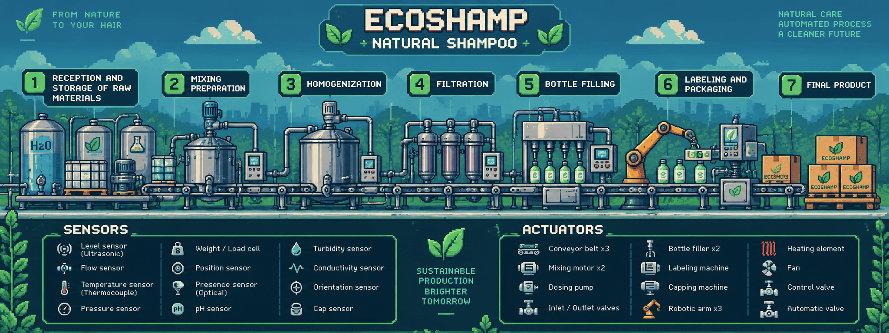
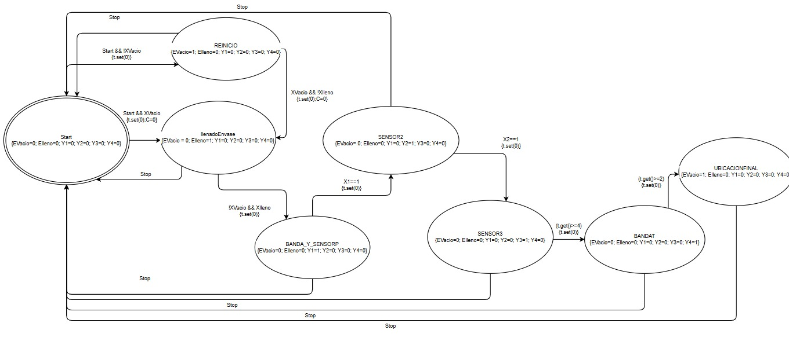
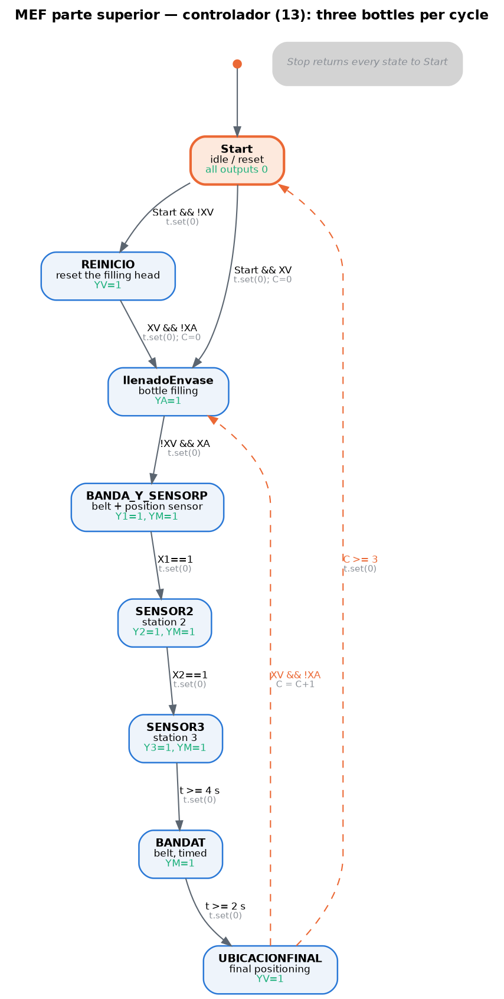
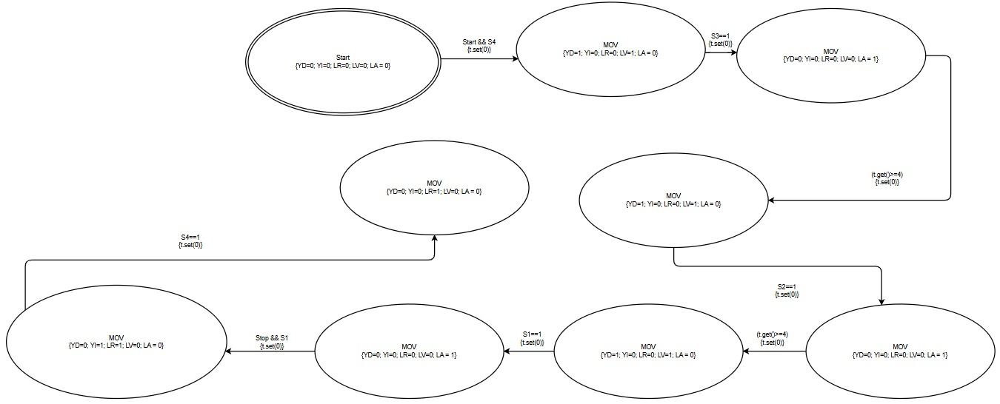

# EcoShamp — Automated Natural Shampoo Nano-Factory

Process automation project for **EcoShamp**, a nano-factory that produces natural,
sustainable, animal-derivative-free shampoo. The plant fits in **12 × 2.3 × 2.3 m** and is
designed for **2,000–3,000 units per day**.

**CAP — Control Automático de Procesos · Universidad EAFIT**

<p align="center">
  
</p>

### ▶ Videos

- **[EcoShamp — project video](https://youtu.be/ZryVBzmH6Tc)**
- **[Subprocess evidence — bottle filling and labelling](https://youtu.be/DVAGxc75j4o)**

*Both videos are in Spanish.*

### 🌐 Website

**[ecoshamp-process-automation.vercel.app](https://ecoshamp-process-automation.vercel.app/)**

---

## The process

Seven subprocesses, one owner each:

| # | Subprocess | Owner |
|---|---|---|
| 1 | Reception and storage of raw materials | Martín Jaramillo |
| 2 | Mixing and preparation | Juan Diego Guerra |
| 3 | Homogenisation | Miguel Vargas |
| 4 | Filtration | Alejandro Muriel |
| 5 | Bottle filling | Juan Esteban López |
| 6 | **Labelling and packaging** | **David Zuluaga Henao** |
| 7 | Final product | — |

This repository documents the whole factory, and in detail the **labelling and packaging**
subprocess: its two finite state machines, the generated controller code and the evidence
of both running.

## The state machines (MEF)

The subprocess is controlled by two finite state machines — one for the **upper part**
(the filling, sealing, labelling and packaging stations) and one for the **lower part**
(the conveyor that positions the bottle). Both were drawn in a state-machine designer that
exports the diagram as XML and generates the controller as JavaScript; both are in
[`04_State_Machines/`](04_State_Machines).

### Upper part

<p align="center">
  
</p>

Redrawn from the exported XML so the conditions and the outputs of each state can be read:

<p align="center">
  
</p>

**States**

| State | Meaning | Outputs asserted | Leaves when |
|---|---|---|---|
| `Start` | Idle and reset | none | `Start && XV` → `llenadoEnvase` · `Start && !XV` → `REINICIO` |
| `REINICIO` | Bring the head back to the empty-bottle position | `YV` | `XV && !XA` |
| `llenadoEnvase` | Bottle filling | `YA` | `!XV && XA` |
| `BANDA_Y_SENSORP` | Conveyor to station 1 | `Y1`, `YM` | `X1 == 1` |
| `SENSOR2` | Station 2 | `Y2`, `YM` | `X2 == 1` |
| `SENSOR3` | Station 3 | `Y3`, `YM` | `t ≥ 4 s` |
| `BANDAT` | Conveyor only, timed | `YM` | `t ≥ 2 s` |
| `UBICACIONFINAL` | Final positioning | `YV` | see below |

`Stop` returns every state to `Start`.

**Two versions.** Both are kept because they answer different requirements:

| File | Behaviour at `UBICACIONFINAL` |
|---|---|
| `controller_three_bottles.js` | Counts bottles: on `XV && !XA` it goes back to `llenadoEnvase` with `C = C+1`, and returns to `Start` once `C ≥ 3`. Three bottles per cycle. |
| `controller_single_bottle.js` | Stays until `Stop`. One bottle per cycle. |

**I/O map** (ESP32 pins, from the generated code)

| Input | Pin | | Output | Pin |
|---|---|---|---|---|
| `Start` | 32 | | `YA` | 22 |
| `Stop` | 33 | | `YV` | 23 |
| `X1` | 35 | | `Y1` | 24 |
| `X2` | 34 | | `Y2` | 25 |
| `XV` (empty bottle) | 36 | | `Y3` | 26 |
| `XA` (full bottle) | 37 | | `YM` (conveyor) | 27 |

### Lower part

<p align="center">
  
</p>

The conveyor machine runs right (`YD`) with the green lamp on, stops at each of the four
position sensors `S1`–`S4` with the amber lamp on, and on `Stop && S1` runs left (`YI`)
with the red lamp until it reaches `S4` again — a home-and-index cycle with an explicit
light indication of what the machine is doing.

## Sensors and actuators

| Upper part — sensors | Upper part — actuators |
|---|---|
| Packaged-bottle sensor | Packaging machine |
| Labelled-bottle sensor | Labelling machine |
| Sealed-bottle sensor | Sealing machine |
| Temperature sensor | Fan |
| Full-bottle sensor | Bottle filling machine |
| Empty-bottle sensor | |
| Start · Stop | |

| Lower part — sensors | Lower part — actuators |
|---|---|
| Position sensors 1 to 4 | Filled-bottle positioner |
| Start · Stop | Conveyor belt motor |

## Continuous control

[`05_Continuous_Control/`](05_Continuous_Control) holds the notebook of the continuous
control test: the transfer function of the DC motor that drives the conveyor
(J = 0.01 kg·m², b = 0.1 N·m·s, Ke = Kt = 0.01, R = 0.9 Ω, L = 0.5 H) derived symbolically
with SymPy, and the response analysed with the `control` library.

## Repository layout

```
01_Company_Report/     Company report and process description (Spanish)
02_Process_Report/     Process report by subprocess (English)
03_Poster/             Project poster, 70 × 100 cm
04_State_Machines/     Controller code (JavaScript), designer XML and MEF diagrams
05_Continuous_Control/ Jupyter notebook of the continuous control test
06_Presentation_Slides/ Slides used to present the subprocess evidence
docs/images/           Images used by this README
website/               Project website (static, deployable on Vercel)
```

## Team

David Zuluaga Henao · Miguel Vargas · Juan Diego Guerra · Martín Jaramillo ·
Juan Esteban López · Alejandro Muriel

Universidad EAFIT — Medellín, Colombia

## License

Academic work produced for CAP at Universidad EAFIT. Shared for reference.
